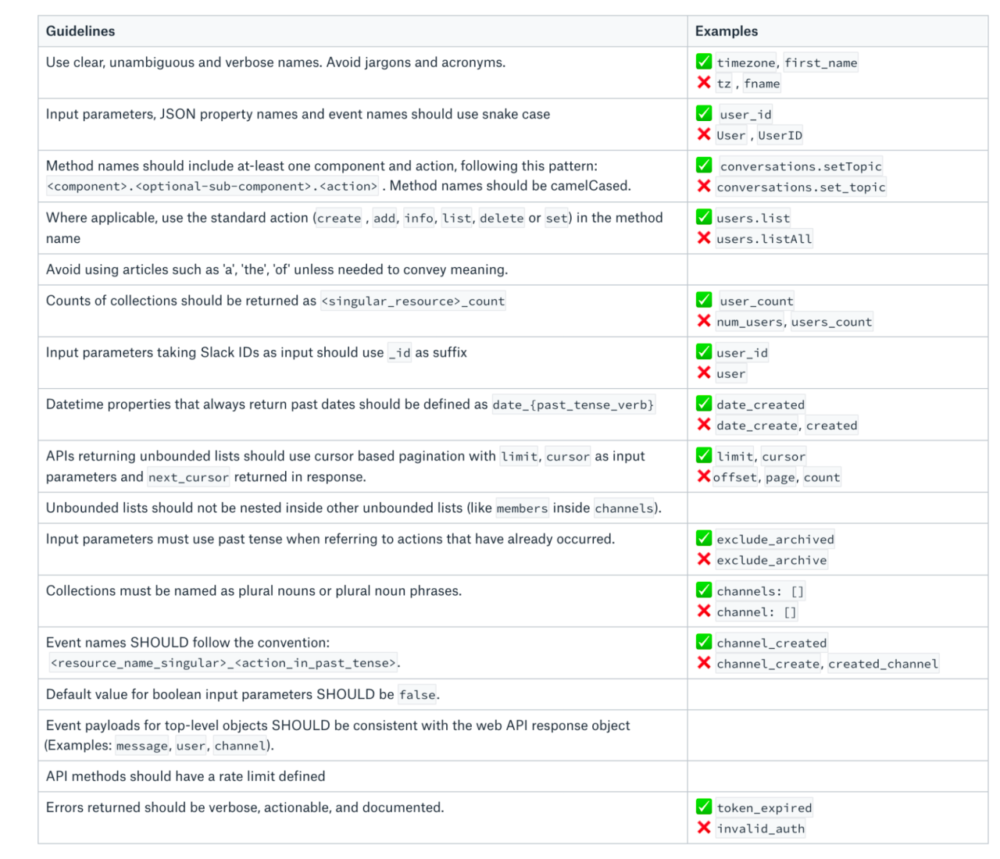
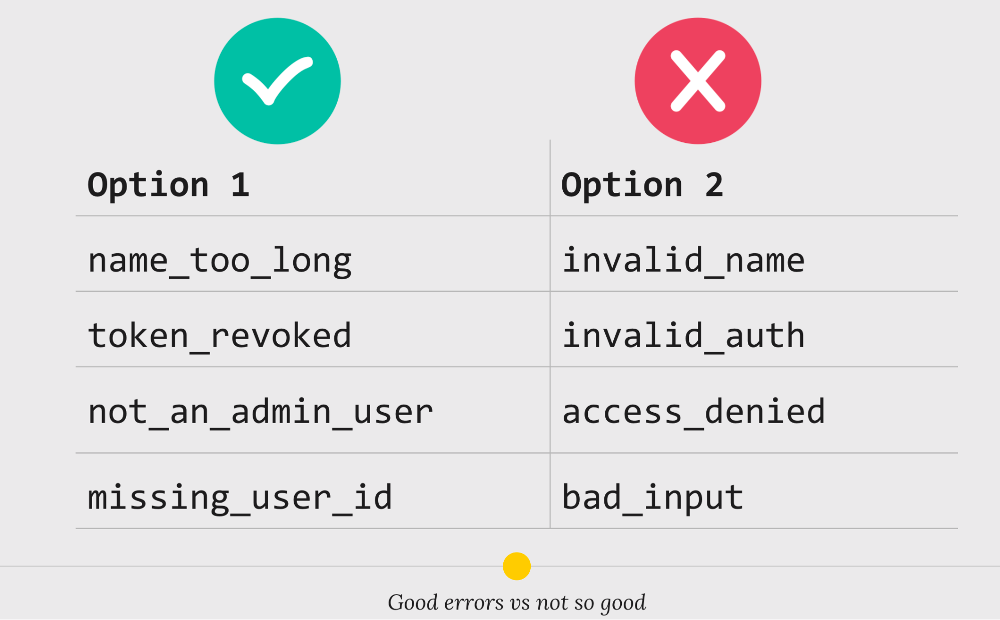
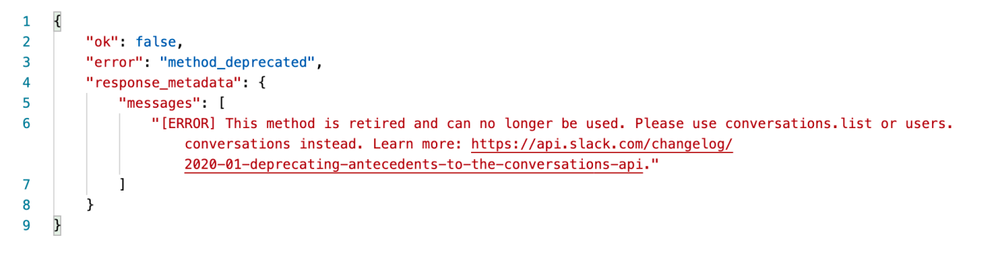

# 技術筆記 20220103

## 資安議題
### [如何用JNDI實現REC漏洞](https://juejin.cn/post/7040455755899600910)
> 本文詳細說明如何利用JDNI中的RMI API達成log4j的REC攻擊，利用針對特定字串格式(ex: ${jndi:xxx.com.tw/evil})執行RMI的查找（lookup）(key: evil, value: MaliciousClass.class)請求達到惡意程式(MaliciousClass.class)的注入。

### [從監視攝影機理解 Log4j 跟 Log4Shell 漏洞](https://tech-blog.cymetrics.io/posts/huli/what-is-log4j-and-log4shell/)
>作者以監視器為例白話解釋了Log4j如何造成REC漏洞

## Programming Skill

### [如何做好抽象化？](https://zxuanhong.medium.com/%E5%A6%82%E4%BD%95%E5%81%9A%E5%A5%BD%E6%8A%BD%E8%B1%A1%E5%8C%96-%E5%B0%B1%E9%9D%A0%E4%B8%89%E9%9A%BB%E7%A9%BF%E9%9B%B2%E7%AE%AD-b56275a89e41)
>作者提出程式抽象化(Abstraction)三個Code Smell：Multifaceted Abstraction
、Imperative Abstraction、Missing Abstraction。
>* **Multifaceted Abstraction**：抽象化被指配過多責任，違反指配單一責任手段。
>* **Imperative Abstraction**：違反從Problem Domain找出entity手段。
>* **Missing Abstraction**：在系統中沒有任何抽象化，違反提供明確的邊界與身份手段。

## 系統設計

### [How We Design Our APIs at Slack](https://slack.engineering/how-we-design-our-apis-at-slack/?fbclid=IwAR2w43kLZ4uIl0uUEaYFjwT4iL6ik4nXUitk72lY48_pVJtW9gcDIhfy3uY)
>Slack工程師回顧過去五年，提出**6個API的設計原則**與**API開發過程的建議**。
>
>**1. Do one thing and do it well**: 
>&emsp;api應該有單一職責，追求越小的顆粒度，避免隨使用人數成長產生太昂貴的開銷。應把回傳值控制在有限的數量或者利用分頁去限制數量。
>
>**2. Make it fast and easy to get started**:
>&emsp;讓使用API的工程師容易調用。並且應該有易上手的API測試工具。
>
>**3. Strive for intuitive consistency**:
>&emsp;API的直觀性與一致性
>
>&emsp;*A preview of Slack’s opinionated API Design Guidelines*
>
>**4. Return meaningful errors**
>&emsp;回應有意義的錯誤
>
>- 回傳格式仔細且講求可讀性(Longer-form error messages )
>
> - 保留原生的Exception, ex: HTTP headers Exception
> 
>**5. Design for scale and performance**
>&emsp;延展性與效能的設計
> - Paginate big collections
> - Do not nest big collections inside other big collections
> 這裡利用Slack拆API`channels.list`成`conversation.list`與`conversation.member`  
> <b>“Good enough” for you probably isn’t good enough for the rest of the world. 
> Part of the joy of an API is never knowing how another developer is going to use it.  </b>
> - Rate limit your API ex: Bucket4j
> 
>**6. Avoid breaking changes**
>&emsp;

 

## WEB 3.0

